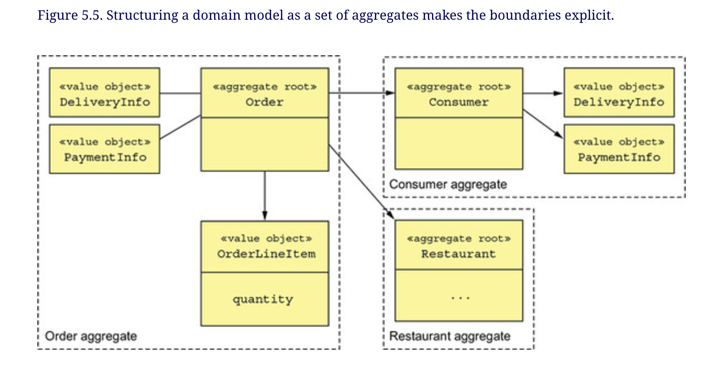

## Chapter 5. Designing business logic in a microservice architecture

- Two main patterns for organizing business logic
  - procedural transaction script
  - object-oriented domain model

### 5.1 Business Logic Organization Patterns

#### 5.1.1 Designing business logic using Transaction script pattern

- Scripts are located in service classes
- Service class has one method for each request/system operation
- Method implements business logic for that request
- Our objects (like an `Order`) are only data - no behavior
- Works well for simple business logic
- Drawback is that it tends not to work well with complex business logic

#### 5.1.2 Designing business logic using Domain model pattern

- Organize the business logic as an object model consisting of classes that have state and behavior
- Classes typically correspond to concepts from the problem domain
  - Order
  - Customer
  - Restaurant

- Service methods are simple and almost always delegate to domain objects
- A service method might load a domain object from the database and then invoke one of its methods

### 5.2 Designing a domain model using the DDD aggregate pattern

#### 5.2.2 Aggregates have explicit boundaries

- Cluster of domain objects within a boundary that can be treated as a unit
- Consists of root entity and possibly one or more other entities and value objects
- Aggregate pattern definition: *Organize a domain model as a collection of aggregates, each of which is a graph of objects that can be treated as a unit*

**AGGREGATES CONSISTENCY BOUNDARIES**

- To update anything within an aggregate, you go through the root entity so that the root entity can enforce invariants
- For example, instead of updating line items' quantities directly, a client must invoke a method on the root of the `Order` aggregate, which enforces invariants such as the minimum order amount

#### 5.2.3 Aggregate rules

- Reference only the aggregate root
- Inter-aggregate references must use primary keys
- One transaction creates or updates one aggregate

#### 5.2.5 Designing business logic with aggregates

- Bulk of business logic consists of aggregates
  - Some business logic also resides in domain services and sagas

